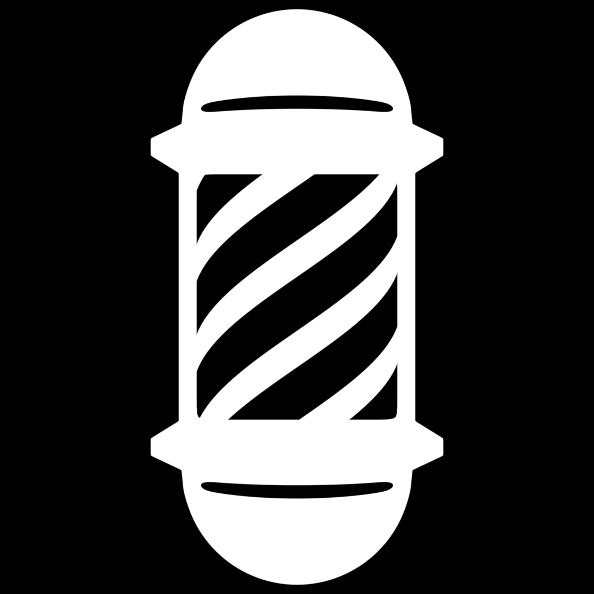
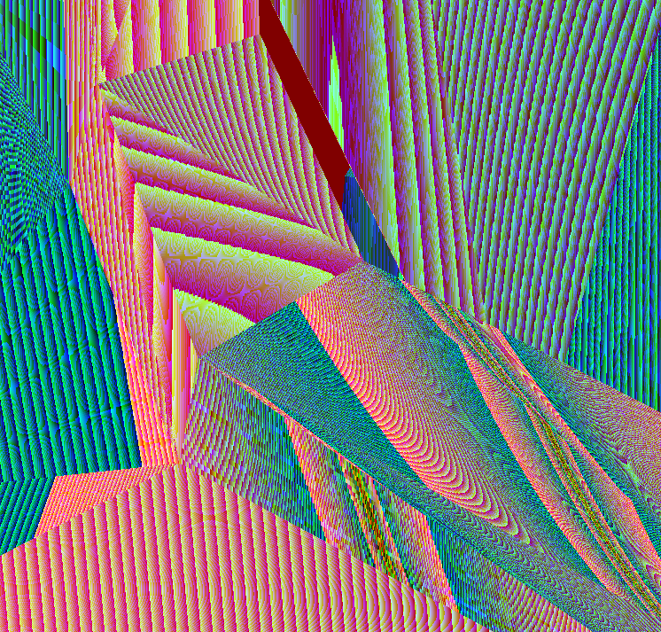

# barbershop
A simple game engine written in C++.

## Installation
Prebuilt binaries are available in the relases page, or you can...
## Build from source
This repository is set up such that only CMake is required to build. 
CMake is configured to extract and use toolchain binaries from the mingw64 archive provided; simply clone the repo, CMake configure (this may take a while) and CMake build. Debug and release presets are available.
These are windows executables, so changes to CMake configuration will be required for compilation on linux.

## Alpha
   
This project is and will be for the considerable future in alpha. It is not recommended to use this project for game development until a beta is released.
